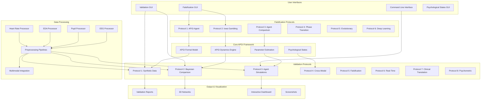
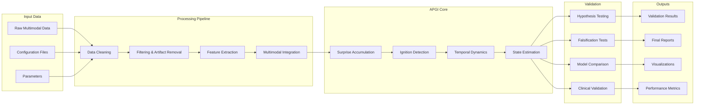
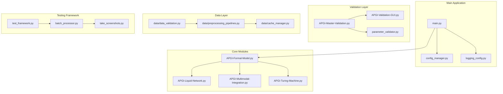
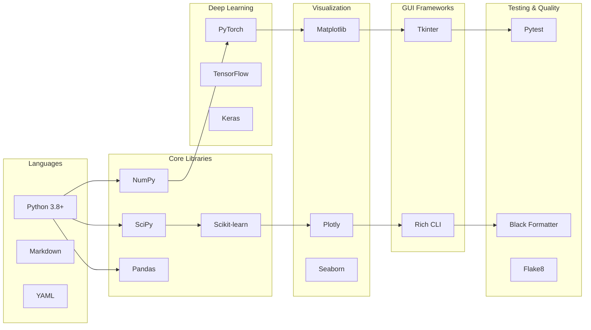
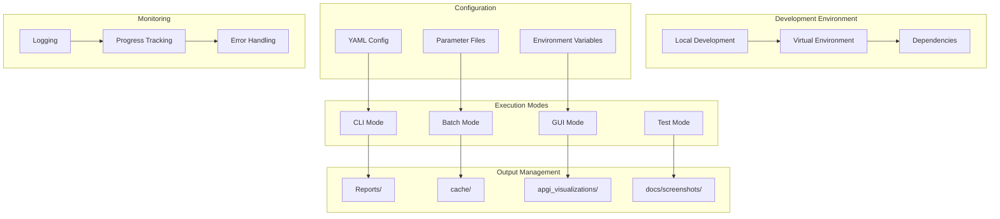
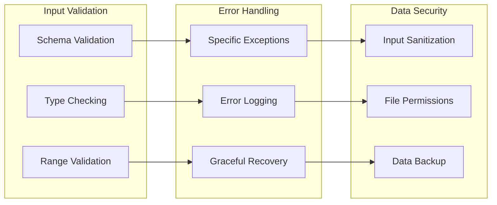

# APGI Validation Architecture

## System Architecture Overview

## Data Flow Architecture

## Component Interactions

## Technology Stack

## Deployment Architecture

## Key Design Patterns

### 1. **Strategy Pattern**: Different validation protocols
### 2. **Factory Pattern**: Agent and environment creation
### 3. **Observer Pattern**: GUI progress updates
### 4. **Command Pattern**: CLI command structure
### 5. **Template Method**: Common validation workflow
### 6. **Decorator Pattern**: Logging and caching
### 7. **State Pattern**: Psychological state transitions

## Security & Error Handling

This architecture documentation provides a comprehensive overview of the APGI validation system's structure, data flow, component interactions, and technology stack.
