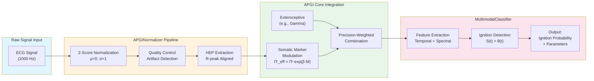

# APGI Theory Framework - Architecture Documentation

## System Architecture Overview

The APGI Theory Framework is designed as a modular, extensible system for computational modeling of conscious access and multimodal integration.

## High-Level Architecture

```text
┌─────────────────────────────────────────────────────────────────┐
│                    APGI Theory Framework                        │
├─────────────────────────────────────────────────────────────────┤
│                        CLI Interface                            │
│  ┌─────────────┐ ┌─────────────┐ ┌─────────────┐ ┌───────────┐ │
│  │   Commands  │ │      GUI    │ │   Config    │ │   Logs    │ │
│  └─────────────┘ └─────────────┘ └─────────────┘ └───────────┘ │
├─────────────────────────────────────────────────────────────────┤
│                    Core Components                              │
│  ┌─────────────┐ ┌─────────────┐ ┌─────────────┐ ┌───────────┐ │
│  │ Formal      │ │ Multimodal  │ │ Parameter   │ │ Validation │ │
│  │ Model       │ │ Integration │ │ Estimation  │ │ Protocols  │ │
│  └─────────────┘ └─────────────┘ └─────────────┘ └───────────┘ │
├─────────────────────────────────────────────────────────────────┤
│                    Infrastructure                                 │
│  ┌─────────────┐ ┌─────────────┐ ┌─────────────┐ ┌───────────┐ │
│  │ Config      │ │ Logging     │ │ Module      │ │ Data      │ │
│  │ Manager     │ │ System      │ │ Loader      │ │ Processing│ │
│  └─────────────┘ └─────────────┘ └─────────────┘ └───────────┘ │
├─────────────────────────────────────────────────────────────────┤
│                    External Dependencies                         │
│  ┌─────────────┐ ┌─────────────┐ ┌─────────────┐ ┌───────────┐ │
│  │ NumPy/SciPy │ │ PyMC/ArviZ  │ │ Matplotlib  │ │ Click/Rich│ │
│  └─────────────┘ └─────────────┘ └─────────────┘ └───────────┘ │
└─────────────────────────────────────────────────────────────────┘
```

## Data Flow Architecture (Mermaid.js Flowchart)

The following Mermaid.js diagram shows the exact data path from a raw ECG signal through APGINormalizer to the MultimodalClassifier:



### Data Path Description

| Stage | Processing Step | Output Format | Computational Cost |
| ----- | --------------- | ------------- | ----------------- |
| 1 | Raw ECG Input | 1000 Hz, 16-bit | O(n) memory |
| 2 | Z-Score Normalization | Standardized signal | O(n) time |
| 3 | HEP Extraction | 600ms epochs post-R | O(n) with FFT |
| 4 | Somatic Modulation | Πⁱ_eff scalar | O(1) per sample |
| 5 | Precision Combination | S(t) accumulated surprise | O(1) per timestep |
| 6 | Ignition Detection | B(t) binary + P(ignition) | O(1) comparison |

### Key Processing Nodes

1. **APGINormalizer**: Handles modality-specific z-scoring with robust statistics
2. **HEP Extraction**: Cardiac-phase aligned averaging (250-400ms post R-peak)
3. **Somatic Modulation**: Exponential gain control via Πⁱ_eff = Πⁱ_baseline · exp(β·M)
4. **Ignition Threshold**: Adaptive θ(t) based on pupil + alpha power

---

## Component Architecture

### 1. CLI Interface Layer

```text
CLI Interface (main.py)
├── Commands
│   ├── formal-model → FormalModelCommand
│   ├── multimodal → MultimodalCommand
│   ├── estimate-params → ParameterEstimationCommand
│   ├── validate → ValidationCommand
│   ├── falsify → FalsificationCommand
│   ├── config → ConfigCommand
│   ├── logs → LogsCommand
│   ├── gui → GUICommand
│   ├── visualize → VisualizationCommand
│   └── info → InfoCommand
├── GUI Integration
│   ├── Validation GUI
│   ├── Psychological States GUI
│   └── Web Analysis Interface
└── Module Loader
    ├── Dynamic Module Loading
    ├── Error Handling
    └── Dependency Management
```

### 2. Core Components

#### Formal Model Component

```text
SurpriseIgnitionSystem
├── State Variables
│   ├── S (Surprise accumulation)
│   ├── theta (Ignition threshold)
│   └── B (Ignition state)
├── Parameters
│   ├── tau_S (Surprise time constant)
│   ├── tau_theta (Threshold time constant)
│   ├── theta_0 (Initial threshold)
│   ├── alpha (Coupling strength)
│   ├── gamma_M (Metabolic gain)
│   ├── gamma_A (Arousal gain)
│   ├── rho (Noise strength)
│   ├── sigma_S (Surprise noise)
│   └── sigma_theta (Threshold noise)
└── Methods
    ├── step(dt, inputs)
    ├── reset()
    └── get_state()
```

#### Multimodal Integration Component

```text
APGI Multimodal Integration
├── APGINormalizer
│   ├── Z-score normalization
│   ├── Modality-specific handling
│   └── Outlier detection
├── APGICoreIntegration
│   ├── Precision-weighted integration
│   ├── Somatic marker modulation
│   └── Surprise accumulation
├── APGIBatchProcessor
│   ├── Batch processing
│   ├── Parallel execution
│   └── Memory management
└── Quality Control
    ├── Data validation
    ├── Artifact rejection
    └── Quality metrics
```

#### Parameter Estimation Component

```text
Parameter Estimation System
├── NeuralSignalGenerator
│   ├── HEP waveform generation
│   ├── P3b waveform generation
│   └── Noise modeling
├── APGIDynamics
│   ├── Surprise accumulation equations
│   ├── Ignition probability
│   └── Parameter relationships
└── Bayesian Estimation
    ├── PyMC models
    ├── MCMC sampling
    └── Parameter inference
```

### 3. Infrastructure Layer

#### Configuration Management

```text
ConfigManager
├── Configuration Loading
│   ├── YAML file parsing
│   ├── Environment variables
│   └── Default values
├── Parameter Validation
│   ├── Type checking
│   ├── Range validation
│   └── Schema validation
├── Dynamic Updates
│   ├── Runtime parameter changes
│   ├── Configuration persistence
│   └── Change notifications
└── Export/Import
    ├── Configuration backup
    ├── Settings migration
    └── Format conversion
```

#### Logging System

```text
APGILogger
├── Log Output
│   ├── Console logging
│   ├── File logging
│   └── Structured logging
├── Performance Tracking
│   ├── Execution time
│   ├── Memory usage
│   └── Resource monitoring
├── Error Management
│   ├── Error categorization
│   ├── Stack trace capture
│   └── Error reporting
└── Log Management
    ├── Log rotation
    ├── Log export
    └── Log cleanup
```

## Data Flow Architecture

### 1. Simulation Data Flow

```text
Input Data → Normalization → Integration → Model → Results → Visualization
     │              │            │        │         │           │
     ▼              ▼            ▼        ▼         ▼           ▼
┌─────────┐  ┌─────────┐  ┌─────────┐ ┌─────────┐ ┌─────────┐ ┌─────────┐
│ Raw     │  │ Z-score │  │ Multi-  │ │ Formal  │ │ State   │ │ Plots   │
│ Data    │→ │ Normal- │→ │ modal  │→ │ Model  │→ │ Vectors │→ │ &      │
│         │  │ ization │  │ Integ-  │ │         │ │         │ │ Charts  │
└─────────┘  └─────────┘  └─────────┘ └─────────┘ └─────────┘ └─────────┘
```

### 2. Parameter Estimation Flow

```text
Experimental Data → Feature Extraction → Model Fitting → Parameter Inference → Validation
         │                   │                │                │              │
         ▼                   ▼                ▼                ▼              ▼
┌─────────────┐ ┌─────────────┐ ┌─────────────┐ ┌─────────────┐ ┌─────────────┐
│ Neural      │ │ Signal      │ │ Bayesian    │ │ MCMC        │ │ Posterior   │
│ Signals     │→ │ Features    │→ │ Models      │→ │ Sampling    │→ │ Validation  │
│ (EEG, etc.) │ │ (HEP, P3b)  │ │ (PyMC)      │ │ (NUTS)      │ │ (ArviZ)     │
└─────────────┘ └─────────────┘ └─────────────┘ └─────────────┘ └─────────────┘
```

### 3. Validation Protocol Flow

```text
Test Data → Protocol Execution → Result Collection → Analysis → Report
    │            │                  │              │          │
    ▼            ▼                  ▼              ▼          ▼
┌─────────┐ ┌─────────┐ ┌─────────┐ ┌─────────┐ ┌─────────┐
│ Test    │ │ Protocol│ │ Results │ │ Statistical│ │ Validation│
│ Cases   │→ │ Code    │→ │ Storage│→ │ Analysis │→ │ Report   │
└─────────┘ └─────────┘ └─────────┘ └─────────┘ └─────────┘
```

## Module Dependencies

### Dependency Graph

```text
main.py
├── click (CLI framework)
├── rich (Terminal UI)
├── config_manager
│   ├── pyyaml (YAML parsing)
│   ├── jsonschema (Validation)
│   └── dotenv (Environment variables)
├── logging_config
│   └── loguru (Logging)
├── APGI_Equations
│   ├── numpy (Numerical computing)
│   └── scipy (Scientific computing)
├── APGI_Multimodal_Integration
│   ├── pandas (Data manipulation)
│   ├── torch (Neural networks)
│   └── sklearn (Machine learning)
├── APGI_Parameter_Estimation-Protocol
│   ├── pymc (Bayesian modeling)
│   ├── arviz (Visualization)
│   └── matplotlib (Plotting)
└── Validation/
    └── Individual protocols
        ├── Various scientific libraries
        └── Custom validation logic
```

## Security Architecture

### 1. Input Validation

```text
User Input → Type Checking → Range Validation → Sanitization → Processing
      │            │              │              │           │
      ▼            ▼              ▼              ▼           ▼
┌─────────┐ ┌─────────┐ ┌─────────┐ ┌─────────┐ ┌─────────┐
│ CLI/    │ │ Pydantic│ │ Custom  │ │ Input   │ │ Core    │
│ GUI     │→ │ Models  │→ │ Checks  │→ │ Cleaning│→ │ Logic   │
│ Input   │ │         │ │         │ │         │ │         │
└─────────┘ └─────────┘ └─────────┘ └─────────┘ └─────────┘
```

### 2. File System Security

```text
File Operations → Path Validation → Permission Check → Access Control → File I/O
        │               │                │               │           │
        ▼               ▼                ▼               ▼           ▼
┌─────────────┐ ┌─────────────┐ ┌─────────────┐ ┌─────────────┐ ┌─────────────┐
│ User        │ │ Path        │ │ OS          │ │ Sandbox     │ │ Safe        │
│ Provided    │→ │ Traversal   │→ │ Permissions │→ │ Restrictions │→ │ File Ops    │
│ Paths       │ │ Prevention  │ │ Check       │ │             │ │             │
└─────────────┘ └─────────────┘ └─────────────┘ └─────────────┘ └─────────────┘
```

## Performance Architecture

### 1. Parallel Processing

```text
Task Queue → Worker Pool → Parallel Execution → Result Aggregation → Output
     │           │              │                  │               │
     ▼           ▼              ▼                  ▼               ▼
┌─────────┐ ┌─────────┐ ┌─────────────┐ ┌─────────────┐ ┌─────────┐
│ Task    │ │ Thread  │ │ Parallel    │ │ Result      │ │ Final  │
│ Splitter│→ │ Pool    │→ │ Processing  │→ │ Collector    │→ │ Output │
└─────────┘ └─────────┘ └─────────────┘ └─────────────┘ └─────────┘
```

### 2. Memory Management

```text
Data Input → Chunking → Processing → Cleanup → Next Chunk
     │          │           │          │           │
     ▼          ▼           ▼          ▼           ▼
┌─────────┐ ┌─────────┐ ┌─────────┐ ┌─────────┐ ┌─────────┐
│ Large   │ │ Memory  │ │ Batch   │ │ Garbage │ │ Stream │
│ Dataset │→ │ Monitor │→ │ Process│→ │ Collector│→ │ Processing│
└─────────┘ └─────────┘ └─────────┘ └─────────┘ └─────────┘
```

## Extension Architecture

### 1. Plugin System

```text
Plugin Discovery → Loading → Registration → Execution → Cleanup
        │            │          │           │          │
        ▼            ▼          ▼           ▼          ▼
┌─────────┐ ┌─────────┐ ┌─────────┐ ┌─────────┐ ┌─────────┐
│ Dynamic │ │ Module  │ │ Plugin │ │ Plugin  │ │ Resource│
│ Import  │→ │ Loader  │→ │ Registry│→ │ Manager │→ │ Cleanup │
└─────────┘ └─────────┘ └─────────┘ └─────────┘ └─────────┘
```

### 2. Custom Model Integration

```text
Custom Model → Interface Compliance → Registration → Integration → Usage
      │                │                  │           │          │
      ▼                ▼                  ▼           ▼          ▼
┌─────────┐ ┌─────────┐ ┌─────────┐ ┌─────────┐ ┌─────────┐
│ User    │ │ Abstract│ │ Module  │ │ Core    │ │ CLI/    │
│ Code    │→ │ Base    │→ │ Loader  │→ │ System  │→ │ GUI     │
└─────────┘ └─────────┘ └─────────┘ └─────────┘ └─────────┘
```

## Deployment Architecture

### 1. Development Environment

```text
Developer Machine → Git Repository → Local Testing → CI/CD → Staging
         │                │              │          │        │
         ▼                ▼              ▼          ▼        ▼
┌─────────────┐ ┌─────────────┐ ┌─────────────┐ ┌─────────────┐ ┌─────────────┐
│ Code         │ │ Version      │ │ Unit Tests   │ │ Automated    │ │ Pre-Production│
│ Editor       │→ │ Control     │→ │ & Validation │→ │ Testing      │→ │ Environment  │
└─────────────┘ └─────────────┘ └─────────────┘ └─────────────┘ └─────────────┘
```

### 2. Production Deployment

```text
Staging → Container Build → Registry → Production Deployment → Monitoring
    │          │               │          │                    │
    ▼          ▼               ▼          ▼                    ▼
┌─────────┐ ┌─────────┐ ┌─────────────┐ ┌─────────────┐ ┌─────────────┐
│ Final   │ │ Docker  │ │ Container   │ │ Kubernetes  │ │ Performance │
│ Testing │→ │ Build   │→ │ Registry    │→ │ Deployment  │→ │ Monitoring  │
└─────────┘ └─────────┘ └─────────────┘ └─────────────┘ └─────────────┘
```

## Quality Assurance Architecture

### 1. Testing Framework

```text
Test Suite → Unit Tests → Integration Tests → Validation Tests → Release
     │           │              │                  │             │
     ▼           ▼              ▼                  ▼             ▼
┌─────────┐ ┌─────────┐ ┌─────────┐ ┌─────────┐ ┌─────────┐
│ Test    │ │ Component│ │ System  │ │ Protocol│ │ Version │
│ Runner  │→ │ Tests   │→ │ Tests   │→ │ Tests   │→ │ Release │
└─────────┘ └─────────┘ └─────────┘ └─────────┘ └─────────┘
```

### 2. Continuous Integration

```text
Code Commit → Build → Test → Quality Check → Deploy
      │         │       │          │           │
      ▼         ▼       ▼          ▼           ▼
┌─────────┐ ┌─────────┐ ┌─────────┐ ┌─────────┐ ┌─────────┐
│ Git     │ │ Auto    │ │ Test    │ │ Code    │ │ Auto   │
│ Push    │→ │ Build   │→ │ Suite  │→ │ Quality│→ │ Deploy │
└─────────┘ └─────────┘ └─────────┘ └─────────┘ └─────────┘
```

## Future Architecture Considerations

### 1. Microservices Architecture

```text
API Gateway → Service Mesh → Individual Services → Data Layer → External APIs
      │            │              │                │           │
      ▼            ▼              ▼                ▼           ▼
┌─────────┐ ┌─────────┐ ┌─────────────┐ ┌─────────────┐ ┌─────────────┐
│ Request │ │ Service │ │ Model        │ │ Distributed │ │ External    │
│ Router  │→ │ Discovery│→ │ Services     │→ │ Database    │→ │ Integrations│
└─────────┘ └─────────┘ └─────────────┘ └─────────────┘ └─────────────┘
```

### 2. Cloud-Native Architecture

```text
Load Balancer → Auto Scaling → Container Orchestration → Cloud Storage → Monitoring
       │            │              │                      │           │
       ▼            ▼              ▼                      ▼           ▼
┌─────────┐ ┌─────────┐ ┌─────────────┐ ┌─────────────┐ ┌─────────────┐
│ Traffic │ │ Dynamic │ │ Kubernetes  │ │ Cloud       │ │ Distributed │
│ Manager │→ │ Scaling │→ │ Cluster     │→ │ Storage     │→ │ Logging     │
└─────────┘ └─────────┘ └─────────────┘ └─────────────┘ └─────────────┘
```

This architecture documentation provides a comprehensive view of the APGI Theory Framework's structure, components, and design principles. It serves as a guide for understanding the system's organization and for planning future enhancements.
